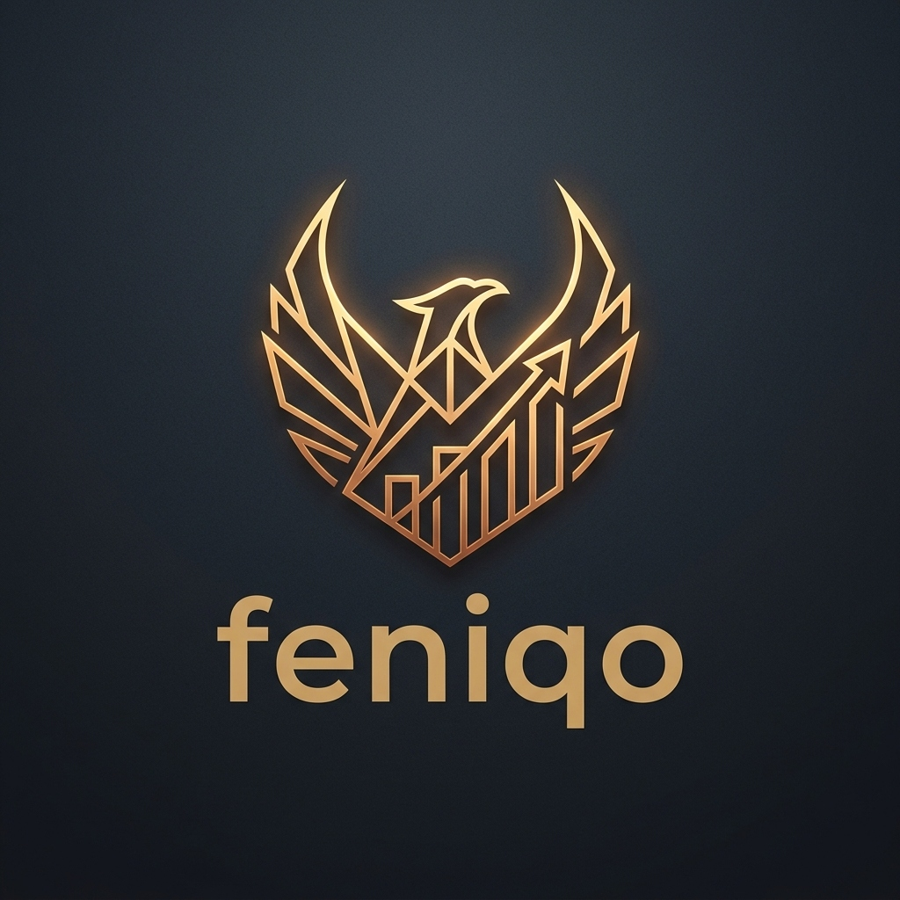
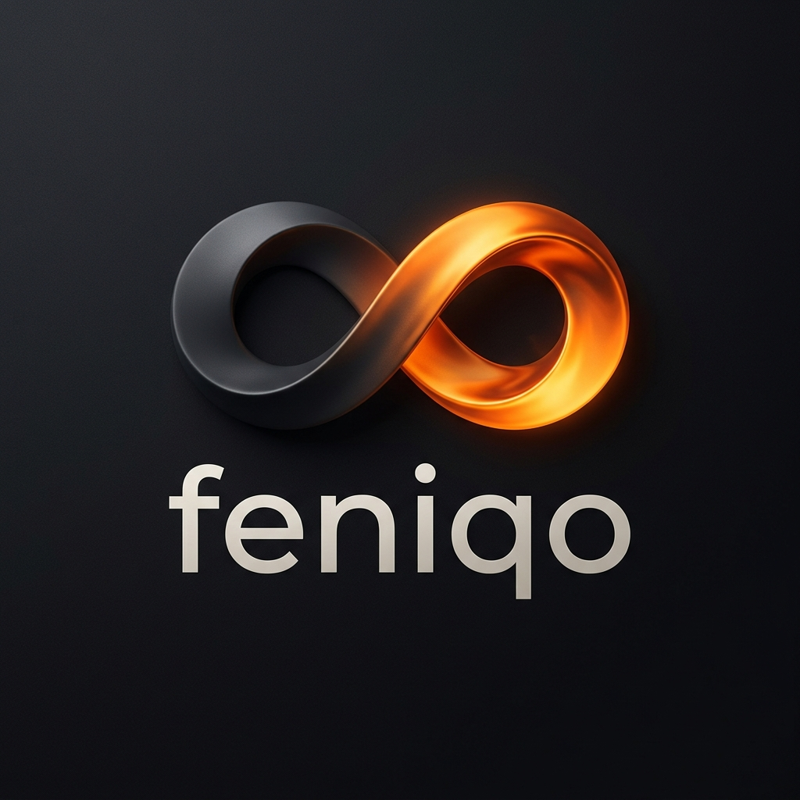
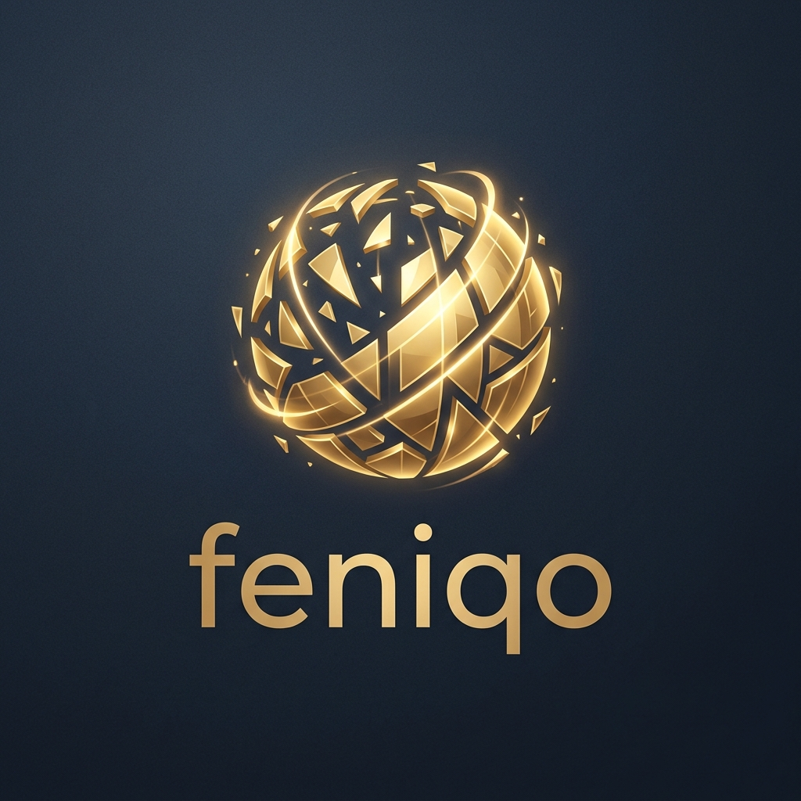
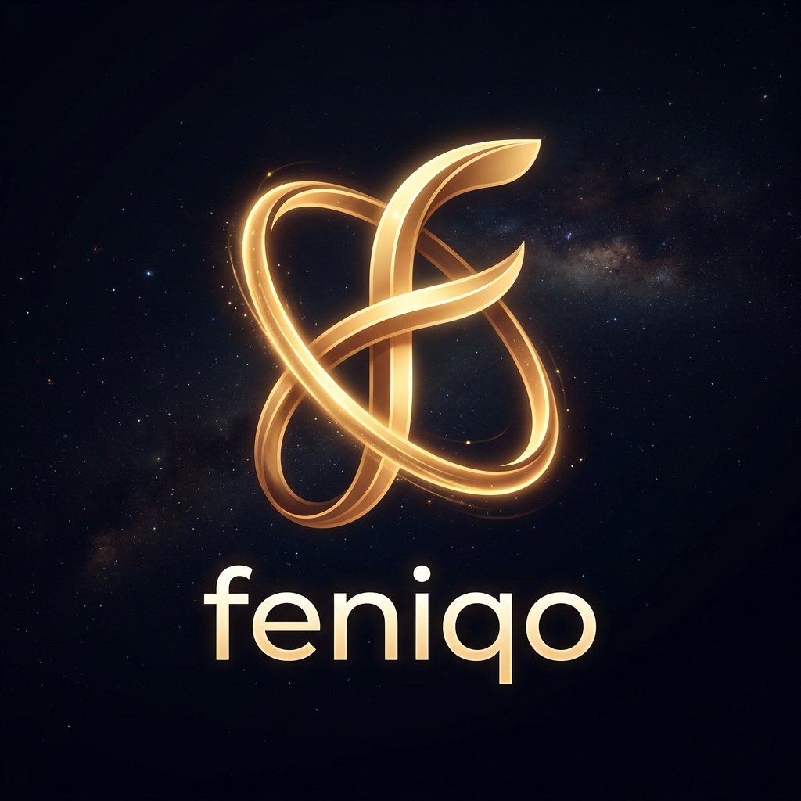
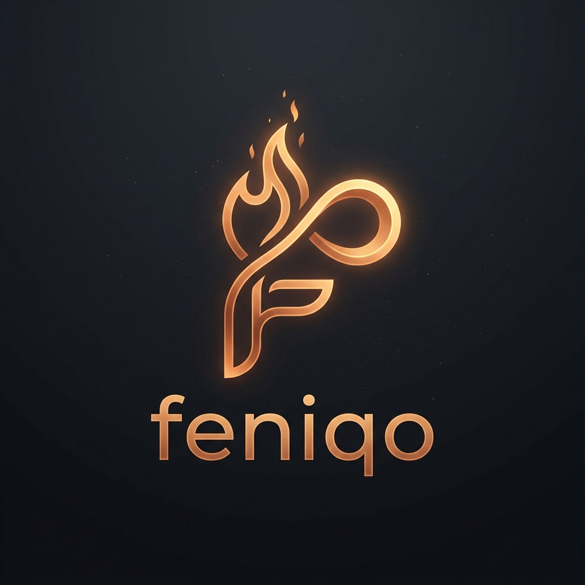

# 🦅 feniqo Brand Identity & Visual System

## 🌟 Seçilen Resmi Logo: Altın Anka Kuşu (Majestic Golden Phoenix & Financial Growth)

Tebrikler! **feniqo** marka vizyonunu en güçlü ve asil şekilde temsil eden **Altın Anka Kuşu ve Büyüme Grafiği** logomuz seçildi ve tüm platformda (Favicon, Apple PWA, Android PWA, Ana Logo ve README) aktif hale getirildi!

Bu muazzam logo:
* **Yeniden Doğuş (Rebirth):** Küllerinden yeniden doğan Anka kuşu figürüyle finansal olarak sıfırdan zirveye ulaşmayı simgeler.
* **Yükseliş & Büyüme:** Göğsünde yer alan finansal grafik barları ve yukarı yönlü okla servet artışını ve finansal gücü temsil eder.
* **Lüks Estetik:** Koyu obsidian zemin üzerinde parıldayan altın çizgileriyle markaya son derece premium ve elit bir hava katar.



---

## 🖋️ Tipografi ve Yazım Kuralları (Typography Guidelines)

> [!IMPORTANT]
> **Logo ve Düz Metin Kullanım Ayrımı:**
> * **Görsel Marka (Logo, İkon, PWA Çizimi):** Modernlik, sadelik ve dijital estetik açısından tamamen küçük harfli **`feniqo`** kullanımı sürdürülür.
> * **Arayüz Başlıkları, Düz Yazılar ve Kurumsal Dil:** Profesyonellik, ciddiyet ve güvenilirlik uyandırması amacıyla platform genelindeki metinlerde ilk harf her zaman büyük olarak **`Feniqo`** şeklinde yazılır.
> * *Örnek:* *"Feniqo | Kişisel Finans ve Varlık Yönetimi"* veya *"Feniqo ile harcamalarınızı yönetin."*

---

## 🎨 feniqo Soyut & Kuşsuz Logo Seçenekleri (Karusel)

Aşağıdaki karuselde kuş veya grafik içermeyen, tamamen bağımsız tasarım dillerine sahip 4 seçeneği inceleyebilirsiniz. Okları kullanarak slaytlar arasında geçiş yapabilirsiniz.

````carousel
### Seçenek 1: The Infinite Flame Loop (Sonsuz Döngü & Yeniden Doğuş)
Sonsuzluk döngüsü (Möbius şeridi) formunda tasarlanmış soyut bir kıvılcım. Bir tarafı koyu füme iken, diğer tarafı akışkan kor turuncusu ve altın sarısı metalik bir gradyana dönüşür. Kuş figürü olmadan küllerinden yeniden doğmayı ve limitleri aşmayı simgeler.


<!-- slide -->
### Seçenek 2: Reassembling Golden Core (Küllerinden Birleşen Servet)
Kayıplardan ve parçalardan yola çıkarak serveti sıfırdan en sağlam şekilde inşa etmeyi temsil eden, havada asılı duran geometrik ışık halkaları ve altın parçacıklarının mükemmel bir küre oluşturacak şekilde bir araya gelişi.


<!-- slide -->
### Seçenek 3: Futuristic F-Monogram Portal (Görsel Geçit)
İki adet içiçe geçen altın ışık halkasından oluşan ve son derece soyut bir küçük "f" (feniqo) harfi çizen teknolojik bir geçit/portal. Finansal olarak yeni ve güvenli bir boyuta geçişi simgeler.


<!-- slide -->
### Seçenek 4: Luxury F-Flame Monogram (Kurumsal F-Ateşi)
Lüks bir startup monogramı olarak tasarlanan, akışkan sıvı bakır-altın gradyanına sahip ve kıvrımlı hatlarıyla hem "f" harfini hem de asil bir alevi (flame) andıran minimalist harf logosu.


````

---

## 🎨 feniqo Kurumsal Renk Sistemi

| Renk | Hex Kodu | Kullanım Alanı | Anlamı |
| :--- | :--- | :--- | :--- |
| **Phoenix Gold (Altın)** | `#F59E0B` | Birincil Butonlar, Canlı Rozeti, Grafik Çizgileri | Refah, Zenginlik, Güneş Işığı |
| **Ember Orange (Kor Turuncu)** | `#F97316` | Vurgulu Alanlar, Kâr/Zarar Pozitif Başarılar | Kıvılcım, Yeniden Doğuş, Ateş |
| **Cosmic Void (Kozmik Gece)** | `#0B0F19` | Koyu Mod Genel Arka Planı | Sonsuz Uzay, Güvenli Liman, Küller |
| **Obsidian Slate (Obsidyen)** | `#1E293B` | Kartlar ve Menü Kutuları | Dayanıklılık, Metal, Güçlü Altyapı |

---

## 🖋️ Slogan Önerileri

1.  *feniqo — "reborn your wealth"* (Servetini yeniden doğur)
2.  *feniqo — "küllerinden doğan güç"* (Bizim favorimiz!)
3.  *feniqo — "smart wealth transformation"* (Akıllı finansal dönüşüm)

---

> [!TIP]
> Bu tamamen kuşsuz ve grafik içermeyen yeni soyut seçeneklerden en çok beğendiğiniz konsepti bana bildirin, feniqo vizyonumuzu o doğrultuda hayata geçirelim!
